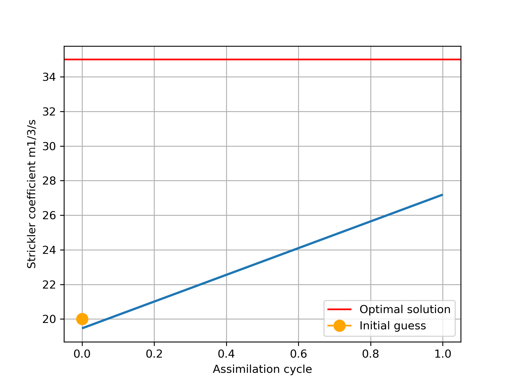

Ensemble Kalman Filter Examples for TELEMAC-MASCARET (with MPI)
===============================================================

Ensemble Kalman Filtering examples with the Telemac-Mascaret hydrodynamic code

Two examples:
- Telemac 2D: a twin experiment based on the 'Estimation' test case where the goal is to estimate the bottom friction coefficient
- Mascaret 1D: a twin experiment with the steady state kernel

  

   <b>Example of T2D convergence for Ne=10 and Ks_initial_value = 20</b>

This Python script uses:
* EnKF algorithm from the 'filterpy' module (http://github.com/rlabbe/filterpy)

* TelApy a set of Python API for the Telemac-Mascaret system

* Mpi4py to use MPI in Python

Requirements
============

- Python 3 (requires Telemac v8p1r1 or above)
- NumPy
- Matplotlib
- Mpi4py

Use
===

For a parallel run with 4 processes:
- `mpirun -np 4 python3 telenkf_t2d_estimation.py`
- `mpirun -np 4 python3 telenkf_masc_test1.py`

License
=======

This package is provided under the MIT license

References
==========

- [F. Zaoui, C. Goeury, Y. Audouin. "Ensemble Integrations of Telemac-Mascaret for the optimal model calibration"](https://hal.archives-ouvertes.fr/hal-01908756)

- John L Crassidis and John L. Junkins. "Optimal Estimation of
Dynamic Systems", CRC Press, second edition. 2012. pp, 257-9

- Y. Audouin, C. Goeury, F. Zaoui, R. Ata, S. El Idrissi Essebtey,
A. Torossian, and D. Rouge. "Interoperability applications of
TELEMAC-MASCARET System", 24th Telemac-Mascaret User Conference,
Graz, Austria, 2017, pp. 57-64

Contributions
=============

Contributions are always welcome ;-)

When contributing to **telenkf** please consider discussing the changes you wish to make via issue or e-mail to the maintainer.
